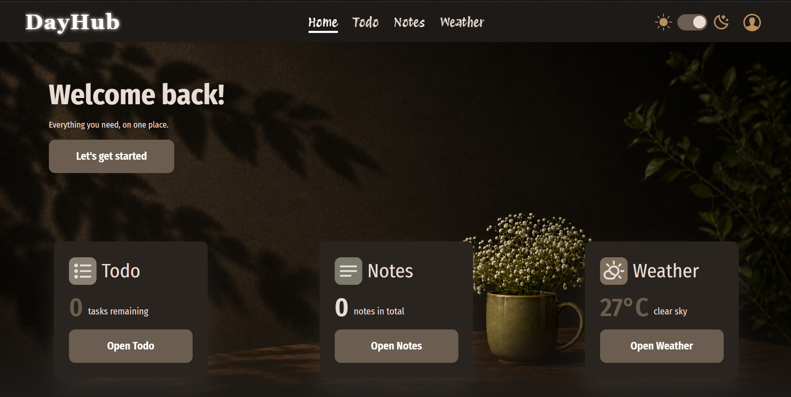
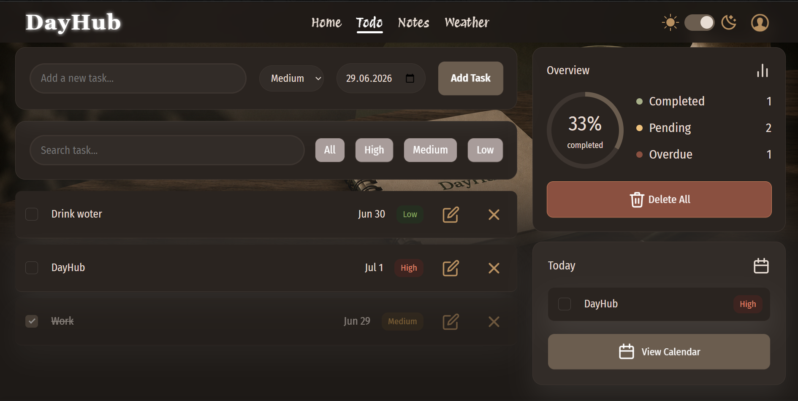
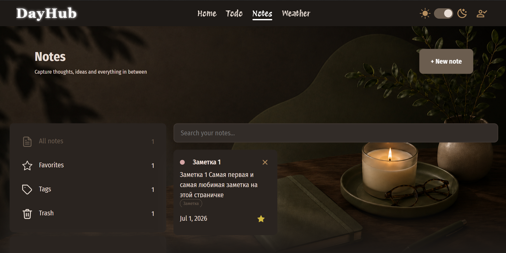
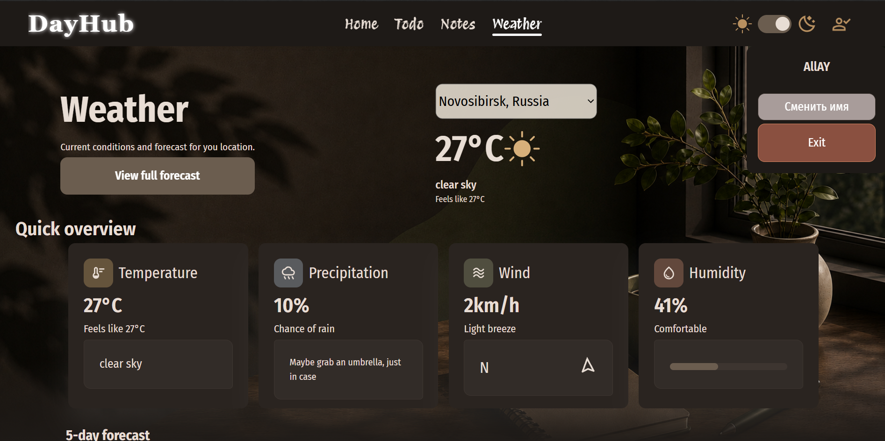

# 🌿 DayHub

> Персональный дашборд для управления задачами, заметками и погодой.

---

## 📌 О проекте

DayHub — это многостраничное React-приложение, разработанное как самостоятельный
практический проект после прохождения курса по React. Идея, архитектура и
реализация — полностью авторские.

Проект в активной разработке — впереди миграция на TypeScript.

**Посмотреть сайт:** https://dayhub.vercel.app/

---

## 🖼 Скриншоты

<p align="center">
  
  
</p>
<p align="center">
  
  
</p>

---

## ✅ Функциональность

**🏠 Home**
- Общий обзор данных со всех страниц (задачи, заметки, погода)

**☑️ Todo**
- Добавление задачи с приоритетом и датой
- Отметка выполнения, редактирование, удаление
- Фильтрация по приоритету, поиск по названию
- Статистика: выполнено / в ожидании / просрочено
- Анимации появления и удаления
- 
**📝 Notes**
- Полный CRUD заметок
- Система тегов (до 3 тегов, до 10 символов)
- Мягкое и полное удаление (корзина)
- Модальный редактор

**🌤 Weather**
- Выбор города
- Текущая погода и прогноз на 5 дней
- Динамические иконки погоды

**🔐 Auth**
- Регистрация и вход
- Хранение сессии в localStorage (без пароля)

**🎨 Прочее**
- Тёмная / светлая тема
- Адаптивная вёрстка (mobile / tablet / laptop)
- Accessibility: aria-атрибуты, семантическая разметка

---

## 🛠 Стек технологий

**Основные:**
- React 19
- React Router DOM 7
- SCSS + BEM
- FSD (Feature-Sliced Design)

**Библиотеки:**
- `classnames` — условные CSS классы
- `react-transition-group` — анимации
- `react-imask` — маски для инпутов
- `react-helmet-async` — SEO / meta-теги

**Инструменты:**
- Vite 8
- ESLint
- `vite-plugin-svgr` — SVG как React компоненты

**API:**
- OpenWeatherMap

---

## 📁 Архитектура (FSD)
```
src/
├── app/          # providers (auth, theme), styles, App.jsx
├── entities/     # notes, todo, user, weather
├── features/     # auth, notes, todo
├── pages/        # Home, Notes, Todo, Weather
├── widgets/      # Header, Footer, HomeHero, WeatherForecast и др.
└── shared/       # assets, lib, ui
```
---

## 🚀 Как запустить

```bash
# Клонировать репозиторий
git clone https://github.com/allay-rne/dayhub.git

# Перейти в папку
cd dayhub

# Установить зависимости
npm install

# Добавить .env с ключом OpenWeatherMap
echo "VITE_API_WEATHER=your_api_key" > .env

# Запустить dev-сервер
npm run dev
```

---

## 🗺 Планы

- [ ] Миграция на TypeScript

---

*Проект разработан в учебных целях*